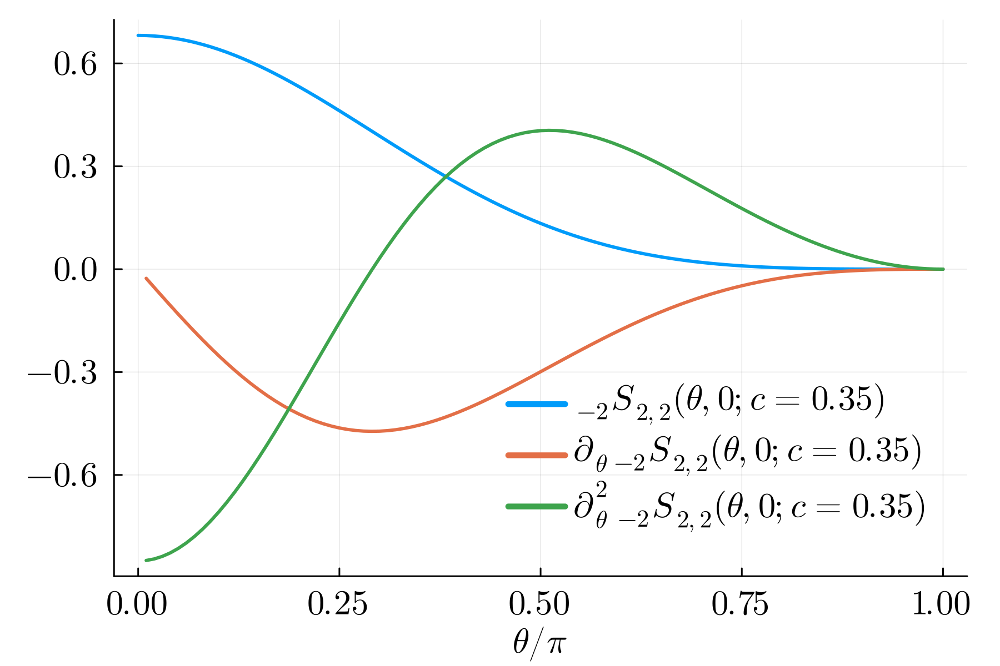

# Examples
# Example 1: Solving and visualizing a spin-weighted spheroidal harmonic
In this example, we solve for the spin-weighted spheroidal harmonic with $s=-2, \ell =2, m = 2, c \equiv a\omega = 0.35$.
```julia
using SpinWeightedSpheroidalHarmonics
using Plots, LaTeXStrings

s=-2; l=2; m=2; a=0.7; omega=0.5;
swsh = spin_weighted_spheroidal_harmonic(s, l, m, a*omega)
```
That's it! Now let us visualize the harmonic itself and the first and second partial derivative with respect to $\theta$:
```julia
thetas = collect(0:0.01:1)
plot(thetas, [real(swsh(theta*pi, 0)) for theta in thetas], linewidth=2, label=L"{}_{-2}S_{2,2}(\theta, 0; c = 0.35)", dpi=300)
plot!(thetas, [real(swsh(theta*pi, 0; theta_derivative=1)) for theta in thetas], linewidth=2, label=L"\partial_{\theta} {}_{-2}S_{2,2}(\theta, 0; c = 0.35)")
plot!(thetas, [real(swsh(theta*pi, 0; theta_derivative=2)) for theta in thetas], linewidth=2, label=L"\partial_{\theta}^2 {}_{-2}S_{2,2}(\theta, 0; c = 0.35)")
plot!(
    legendfontsize=14,
    xguidefontsize=14,
    yguidefontsize=14,
    xtickfontsize=14,
    ytickfontsize=14,
    foreground_color_legend=nothing,
    background_color_legend=nothing,
    legend=:bottomright,
    formatter=:latex,
    xlabel=L"\theta/\pi",
    left_margin = 2Plots.mm,
    right_margin = 3Plots.mm,
)
```


# Example 2: Solving and visualizing a spin-weighted spherical harmonic
In this example, we solve for the spin-weighted _spherical_ harmonic with $s=-2, \ell =200, m = 10$. The highly oscillatory nature could be challenging for some codes. Let us see if this is the case here. 
```julia
using SpinWeightedSpheroidalHarmonics
using Plots, LaTeXStrings

s=-2; l=200; m=10;
Y = spin_weighted_spherical_harmonic(s, l, m)
```
Now we visualize the harmonic:
```julia
thetas = collect(0:0.001:1)
plot(thetas, [real(Y(float(theta*π), 0)) for theta in thetas], linewidth=2, label=nothing, dpi=300)
ylabel!(L"{}_{-2}Y_{200,10}(\theta, 0)")
plot!(
    legendfontsize=14,
    xguidefontsize=14,
    yguidefontsize=14,
    xtickfontsize=14,
    ytickfontsize=14,
    foreground_color_legend=nothing,
    background_color_legend=nothing,
    legend=:bottomright,
    formatter=:latex,
    xlabel=L"\theta/\pi",
    left_margin = 2Plots.mm,
    right_margin = 3Plots.mm,
)
```

Looking good!